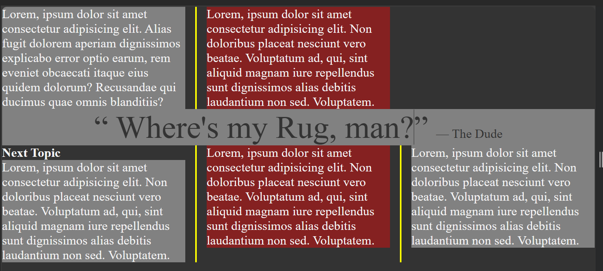

#CSSProperties 

#column-count 
- apply this property to parent of the elements which we want to arrange as columns 
#column-width
- for giving minimum width to the columns if the width goes below this it will get stacked and not shrink
#column-rule
- column rule will crete section between column like border but single line 
#column-gap
- will apply the gap in columns 
```css
.column {
    /* this will arrange all the child element into columns */
    column-count: 4;
    /* so each column must be getting 250px minimum or else it will be stacked below
    the other column if the width decreasess further all column will be in one line */
    column-width: 250px;

    /* same as above two properties */
    columns: 4 250px;
    /* column rule will crete section between column like border but single line */
    column-rule: 3px solid #333;
    /* spacing between column */
    column-gap:3rem;

}
```

#break-inside
- this will avoid the data of one paragraph in getting two column 
- i.e. splitting of a paragraph in two columns
```css
.column h2 {
    break-inside: avoid;
}
```

#column-span : all
- this will span that element or paragraph into all the column and will get into middle

```css
.column .quote {
    /* this code will make the quote in the middle of the all columns */
    column-span: all;
    /* it iwll work with .column .quote to increase specificity */
    margin-top: 2rem;
}
```

#white-space : nowrap #watchagain 3.34 

<hr>

```html 
<body>

<section class="column">

    <p>Lorem ipsum dolor sit amet consectetur adipisicing elit. Quia iure ex omnis neque, natus ipsam asperiores sequi id nisi autem, placeat minima ea obcaecati animi itaque facere tempore quos in.</p>

    <p>Dolorem nesciunt repellat sed quo maiores, in dolores eveniet autem, deleniti architecto reprehenderit sit id! Voluptatibus sed illum, ratione aspernatur quod eos numquam, laborum eveniet dolor, autem harum excepturi incidunt.</p>

    <p class="quote">&#8220; Where's my Rug, man?&#8221; <span class="nowrap">&#8212; The Dude</span> </p>

    <h2>Next Topic</h2>

    <p>Ratione vitae architecto saepe explicabo placeat quasi nam nemo ullam, at quod blanditiis. Natus, fuga! Perspiciatis totam consequuntur harum! Doloremque provident, quia veritatis laudantium ducimus nihil possimus ea. Odit, nihil.</p>

    <p>Accusamus quaerat eum minima laborum iste in eius, odio odit adipisci iure nulla perspiciatis dolorum ipsa deleniti asperiores nemo sapiente nihil quibusdam exercitationem. Doloremque dolore excepturi modi perspiciatis? Velit, et?</p>

</section>

  

    <p>Soluta ipsam architecto ut eos dolorum perferendis explicabo debitis! Id odit aperiam qui tempora molestias quos amet eius. At, voluptatem! Harum, voluptatum necessitatibus neque nisi hic quisquam expedita et quo.</p>

</body>
```

```css /* @import url('https://fonts.googleapis.com/css2?family=Roboto@1&display=swap'); */


body {
    font-size: 1.5rem;
    /* font-family: 'Roboto', sans-serif; */
}

.column {
    /* this will arrange all the child element into columns */
    column-count: 4;
    /* so each column must be getting 250px minimum or else it will be stacked below
    the other column if the width decreasess further all column will be in one line */
    column-width: 250px;

    /* same as above two properties */
    columns: 4 250px;
    /* column rule will crete section between column like border but single line */
    column-rule: 3px solid #333;
    /* spacing between column */
    column-gap:3rem;

}

.column p{
    margin-top: 0;
}

.column h2 {
    margin-top: 0;
    background-color: #333;
    color: #fff;
    padding: 1rem;

    /* this will avoid breaking of elemnts and go into tow differnt column */
    break-inside: avoid;

    /* dont use this */
    /* break-before: column; */
}

.column .quote {
    /* this code will make the quote in the middle of the all columns */
    font-size: 3rem;
    text-align: center;
    color: #333;
    column-span: all;
    /* this will not be applied because of specificity */
    /* it iwll work with .column .quote to increase specificity */
    margin-top: 2rem;
}

.nowrap {
    white-space: nowrap;
}
/* 3.34 */
```