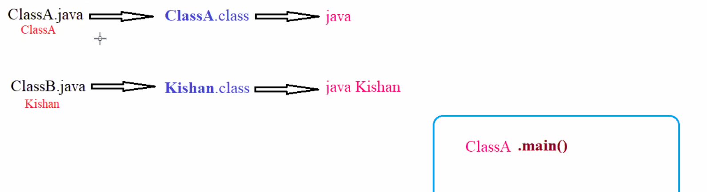

### Understanding Main() Method

- syntax 
public static void main(String[] args) { }

public : 
<strong><em>Because it should be available to all the classes which are present in our project the main method is declared as public</em></strong>

#accessModifiers 
1. #public : 
- if a method is declare public we can access it anywhere. i.e. in same class, same package , and different package.
2. #private : scope - only within class 
- if a method is declared private it can access only in same class.
- cannot access it in other class in same package
- cannot access it in class in different package
3. package-private ( #default) : only withing package 
- can be accessed in same class 
- can be accessed in same package 
- cannot be accessed outside the package 
4. #protected (later)

Note: <strong><em>Because it should be available to all the classes which are present in our project the main method is declared as public</em></strong>

 

static : 
<strong><em>In order to call a static method no need of creating an object we can call a static method directly with the help of class name. As main method is declared as static whenever we are running our java program from that command, class name will be accepted and that respective main method will be getting executed</em></strong>

- method, variable , and Block can be declared as static
1. static method is called with class name 
2. to call no need of object 
3. after compilation .class file name will be generated
4. for running we will do java Class Name jvm will call ClassName.main() internally 
5. if it is not static we have to create object which is not possible without main method hence it is declared as static

in the image we can see jvm internally calls the main method for class

 

void : 
<strong><em>Every java program execution should start from main() method and ends with the main() method if main method is having any other return type except void then the program execution will not be completd with the main method. </em></strong>

 

main: 
<strong><em>It is JUST A NAME, there is no technical meaning, but it is predefined</em></strong>

String[] args : 
<strong><em>Java main method accepts a "single" argument of type String Array. This is also called as Java Command Line Arguments</em></strong>
- args is identifier name we can use any other name
- command line arguments
- at the time of compilation running we provide the cli args

 

Homework : which of the following main() method syntax are valid

1. public static void main(String[] args): valid 
2. public static void main(String []args):valid 
3. public static void main(String [] args):valid 
4. public static void main(String args []):valid 
5. public static void main([] String args):invalid
6. public static void main(String[] kishan):valid 
7. static public void main(String[] args) : invalid 
8. public static int main(String[] args) : invalid
9. public final static void main(String[] args): invalid
10. Public static void main(String[] args): invalid
11. final public static void main(String[] args): invalid
12.  Final public static void main(String[] args): invalid
13. public static void main(String... args): invalid 
14. public static void mian(String[] args): invalid 
15. public static void main(String[8] args): invalid 
16. public static void main(int[] args): valid 
17. public static void main(): invalid 
18. public void main(String[] args): invalid 
19. public static void Main(String[] args): invalid 