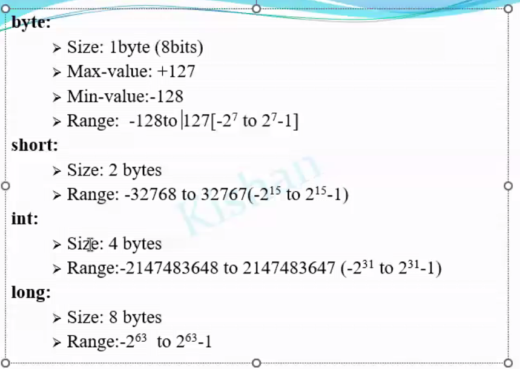

|Primitive Datatype|Non-Primitive/ Referenced / Userdefined Datatypes|
|---|---|
|int short long byte   float double   char   boolean|eg. String, Array, Abstract Class, Enum|

- Primitive Datatypes 
1. Numeric
	1. Integral
		1. int
		2. byte
		3. short
		4. long
	2. Floating 
		1. float 
		2. double 
2. Character 
	1. char 
3. Boolean
	1. boolean

char : 1 character only that should also only in ascii

booleand : true or false 

#### Default value for datatypes
default value for int  : 0
default value for byte : 0
default value for short : 0
default value for long : 0
default value for float : 0.0
default value for double : 0.0
default value for char : (space /u0000 (NPC : non printable character))
default value for boolean : false
	in java boolean will be either true or false not 1 or 0 unlike c or c++