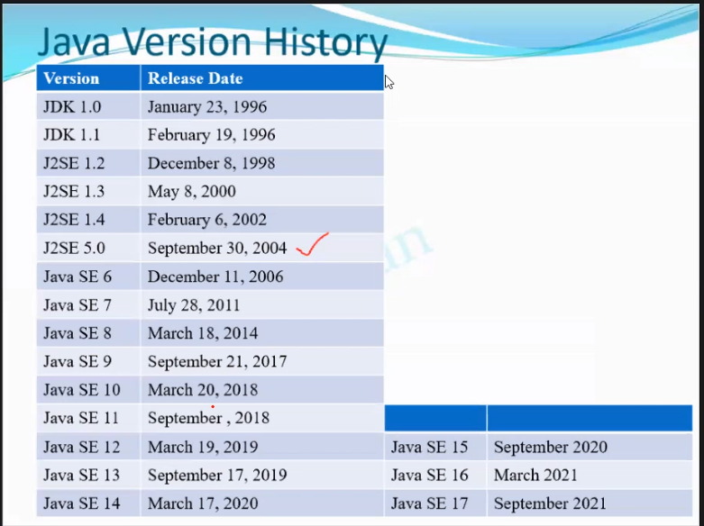

- developed by SUN engineers called green team
- in c excessive use of pointers
	- pointers hold address location.
	- causes memory leakages.

- LTS - long term support

--> Green Talk ---> Oak ---> Java (1995)
---> .gt            --->         ---> .java 

#interview 
- difference between java c and c++

|Features|c|c++|Java|
|---|---|---|---|
|Developed By|Dennis Ritchie|Bjarne Stroustrup|James Gosling|
|Model|Procedure Oriented programming (mainly concentrates on step by step flow of execution, no such thing as accessModifiers)|OOP (conc on data security like access modifier)|OOP|
|Platform Dependency (compile in machine and run anywhere is platform indepencency)|Dependent|Dependent|Platform Independent [W-O-R-A] (write once run anywhere)|
|Keywords|32|63|50   (Note: *true, false, null --> are not keywords they are literals*)|
|Pre Processor Directives :-   ||||