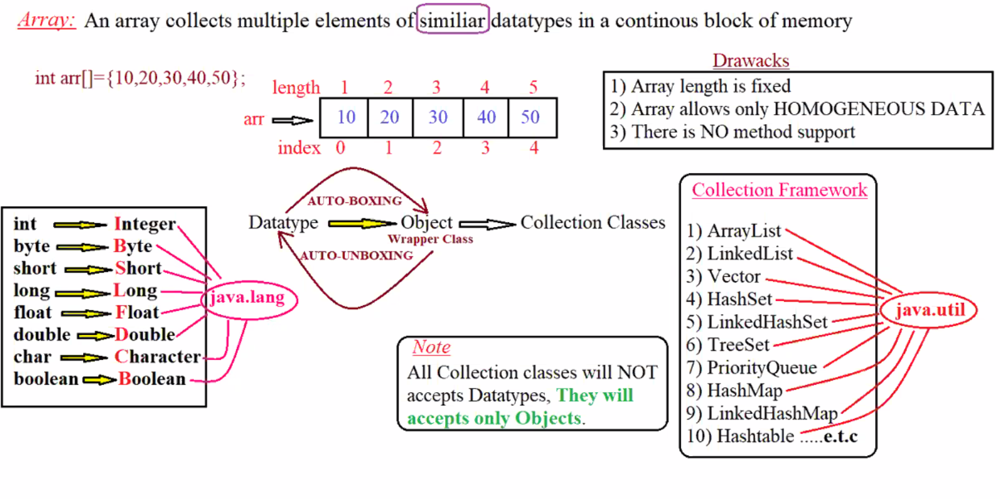

---
~
---

### Wrapper Classes 

1. in java if we want to represent a group of objects in the form of an object then we have to use collection framework 
2. In java applications collection objects are able to allow only a group of other objects they will not accept primitive datatype if we want to store primitive data in collection classes first we need to convert the primitive datatype into their respective object forms and then pass that objects into collection classes.

#### ARRAY
- An Array Collects multiple elements of similar datatype in a continuous block of memory
- an array is data structure which stores multiple elements of SIMILAR datatype in continuous order
-- DRAWBACK OF ARRAY 
1. ARRAY Length fixed 
2. array allows only Homogeneous data 
3. there is no method support 

datatype ----> wrapper class === Auto-boxing
wrapper class ---> datatype ===  Auto-unboxing

Auto-boxing - converting datatype into its respective class object