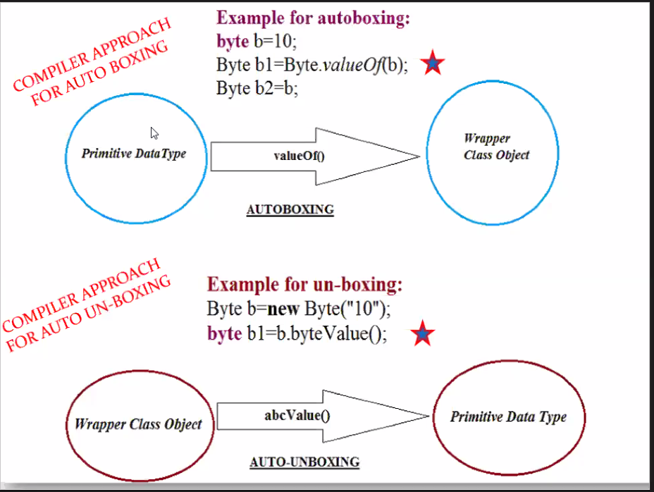

1. Compiler approach for Auto-Boxing 

|Primitive Data type   |  --- valueOf() --->  |   Wrapper Class Object|
|---|---|---|
```java 
//eg
byte b = 10;
Byte b1 = Byte.valueOf(b);
Byte b2 = b;
```

2. Compiler approach for Auto-unboxing 

|Wrapper Class Object |  --- abcValue() --->  |  Primitive Data type|
|---|---|---|

eg for un-boxing
```java 
Byte b = new Byte("10");
byte b1 = b.byteValue();
```

```java 
public class ClassA {
    void autoBoxing() {
        System.out.println("implementing auto-boxing");
        int i = 10;
        Integer ival1 = i; // 1st way
        Integer ival2 = new Integer(i); // 2nd way has been deprecated
        Integer ival3 = Integer.valueOf(i);// 3rd way //compiler approach

        System.out.println("int PDT i : " + i);
        System.out.println("Integer WCO ival1 : " + ival1);
        System.out.println("Integer WCO iva2 : " + ival2);
        System.out.println("Integer WCO ival3 : " + ival3);

        char c = 'A';
        Character cval1 = Character.valueOf(c);
        Character cval2 = new Character(c);
        System.out.println("Character WCO cval1 : " + cval1);
        System.out.println("Character WCO cval2 : " + cval2);

        float f = 10.9f;
        Float fval = Float.valueOf(f);
        System.out.println("float PDT f : " + f);
        System.out.println("Float WCO fval : " + fval);
    }

    void autoUnboxing() {
        System.out.println("Implementing auto-unboxing");
        Byte bval = new Byte((byte)50);
        byte b1 = bval; //1st way
        byte b2 = bval.byteValue(); //2nd way
        System.out.println("Byte WCO bval : "+bval);
        System.out.println("byte PDT b1 : "+b1);
        System.out.println("byte PDT b2 : "+b2);

        Long lval = new Long(5000);
        long l = lval.longValue();
        System.out.println("Long WCO lval : "+lval);
        System.out.println("long PDT l : "+l);

        Character cval = new Character((char)65);
        char c = cval.charValue();
        System.out.println("character WCO cval : "+cval);
        System.out.println("char PDT c : "+c);
    }
    /*
     * Almost all wrapper classes will accept their respective 
     * primitive data types as their parameter and the string 
     * also as their parameter
     */

     void meth1() {
        System.out.println("meth1() called");
        Integer ival1 = new Integer(500);
        Integer ival2 = new Integer("100");
        //Integer ival3 = new Integer("java"); // throws NumberFormatException
        System.out.println("ival1 : "+ival1);
        System.out.println("ival2 : "+ival2);
        // System.out.println("ival3 : "+ival3);

        Boolean booleanval = new Boolean("true");
        System.out.println("booleanval : "+booleanval);
    }

    public static void main(String[] args) {
        ClassA aobj = new ClassA();
    }
}
```

