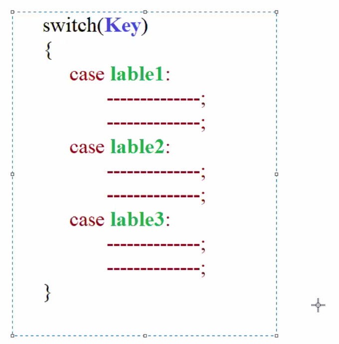

1. Syntax
```java 
//switch syntax 
switch(key) {
case (label1) :
------------- ;
------------- ;
case (label2) :
------------- ;
------------- ;
}
```



1. up to java 1.4 version switch accepts only 4 datatypes (int, byte, short, char)
2. from java 1.5 version onwards switch started accepting their respective wrapper classes also (Integer, Byte, Short, Character)
3. from java 1.7 version onwards switch started accepting string also 
4. inside switch case we can write any no of case labels. if a case label got matched with the key value then from that case all the cases which were present inside the switch will be getting executed
5. in order to avoid this situation if we want only the case which got matched with key value to be executed then we need to use break statements <span style="color:red;">break statements</span> 
6. when ever the compiler came across the break statement the program will not be terminated, the compiler will just come out from the block 
7. if no case label is matching with the key value then we can write default case
8. default case will be getting executed only if no case label is matching with the key value irrespective of its position we can write default case anywhere inside the switch case statement 
9. Duplicate case labels are not allowed in switch 
10. key datatype and the case label datatypes should be compatible. 
11. case label values range should be within the key datatype
12. we can write expressions also at key and labels 
13. individual statements are not allowed in switch case that is every statement should be belonging to a particular case 
14. inside switch case we can write any valid java code 
15. every case label value should be compile time constant  
16. all the cases including break and default case are optional in switch 

```java 
public class ClassA {
    void meth1(String name, int age, String vehicle) {
        System.out.println("implementing switch case ");
        final int i = 40;
        int x = 50;
        // i++; //CE because final variable are constant

        byte b = 20;
        switch ((b + b) / 2 + 45) {
            default:
                System.out.println("default case got exected");
                break;
            case 10:
                System.out.println("case 10 executed");
                break;
            case 200-180:
                System.out.println("case 20 executed");
                break;
            case 'A':
                System.out.println("case 65 executed");
                System.out.println("int and char are compatible");
                if(x<=10) {
                    System.out.println("if block executed");
                }else {
                    System.out.println("else block executed");
                    if(age >=18) {
                        switch (vehicle) {
                            case "Car":
                                    System.out.println(name + "can drive car ");
                                    System.out.println(name + " age is "+age);
                                    break;
                            case "Bike":
                                    System.out.println(name + "can drive bike ");
                                    System.out.println(name + " age is "+age);
                            default:
                                    System.out.println("invalid data");
                                break;
                        }
                    }
                    else {
                        System.out.println(name + " should not drive");
                        System.out.println(name + " will be able to drive after "+(18-age)+" year");
                    }
                }
                break;
                case i;
                    System.out.println("case 40 excuted");
                    break;
                case 50;
                    System.out.println("case 50 executed");
                    break;
        }
        System.out.println("compile came out from switch case");
    }
}
```