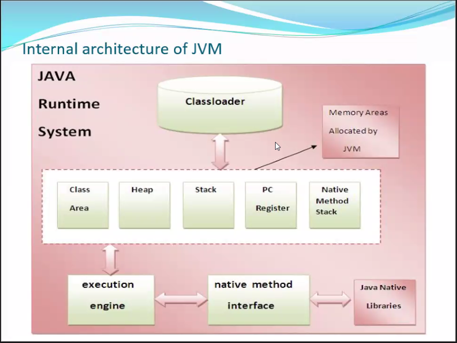

- Internal Architecture of JVM 
1. Class Loader 
2. 5 Memory Area
	1. Class Area
	2. Heap Area
	3. Stack Area 
	4. PC-Registers
	5. Native Method Stack
3. Execution Engine 
	1. Interpreter 
	2. Garbage Collector

1. Class Loader 
	Note - *not present in JVM but above the JVM*
	- from class loader the .class file will be coming into JVM
	it does three things 
		1. Loading - .class file will be loaded into memory
		2. Linking - the linking between both the classes is done
		3. Initialization - for static the memory will be assigned when the static variable are initialize .static variable will be initialize at the time of loading not at the time of running

2. Memory Area 
	1. Class Area - It stores the metadata (data about the data) information of the class.
	2. Heap Area - Every class object we create in code will be stored inside heap area.
		1. it stores all the class object which we are creating
		2. inside #heap area there is one more special memory know as SCP ( `String Constant Pool`) which is allocated to