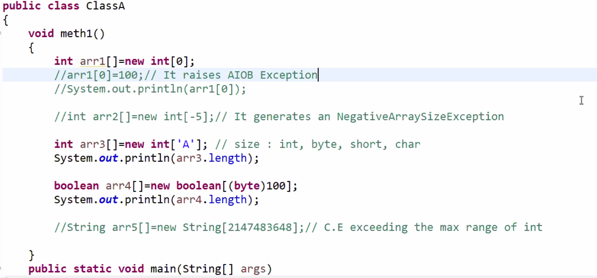

1. every array in java is an object
2. whenever we are declaring an array we should never specify its size.
```
int arr[5]; -> invalid      int arr[]; -> valid 
```

3. at the time of array instantiation 100% we need to specify the, otherwise we will be getting an compiler time error. 
```
int arr[] = new int[]; -> invalid
int arr[] = new int[5]; -> valid
```

4. whenever we are instantiating an array with a specific size every memory block of that array will be filled with the default value of it datatype of the array.
5. we can give zero also as size of an array but we cannot pass elements into that array
6. we cant give negative numbers as size of an array. it generates NegativeArraySizeException 
7. we can use int, byte, short, char for specifying the size of an array. 
8. max size of array can be Maximum size of int datatype [2147483647]


![[Pasted image 20231223083901.png]]