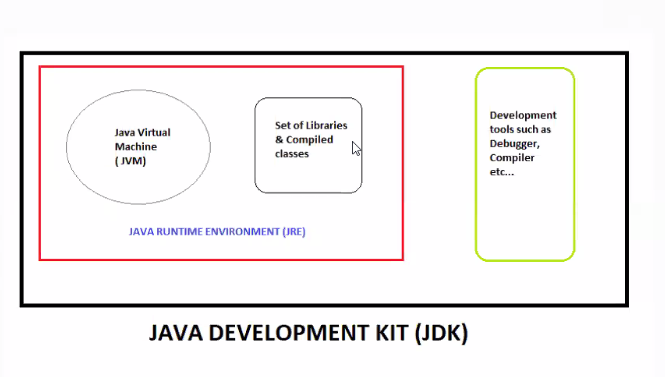
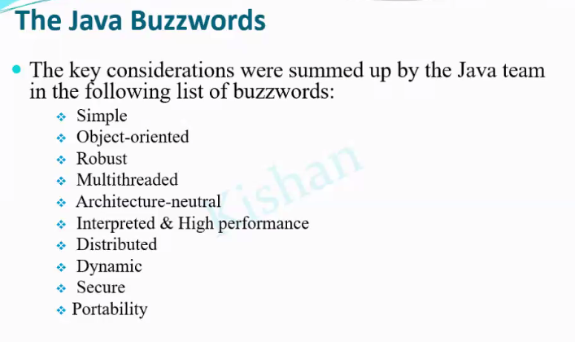

#interview jdk vs jre vs jvm ?
JDK = JRE + development tools 

JRE = JVM + Set of Libraries and Compiled Pre-defined Classes 
JVM is responsible for running of java program 
5 memory areas are present in jvm and explain these in #interview 

#interview Why choosing career as Java developer? 
- we need to defend our choice 
- we need to say some Features
- simple, enjoy coding in java, robust unlike js, all good features of object oriented programming, fast, optimized speed between purely compile and interpreted languages

