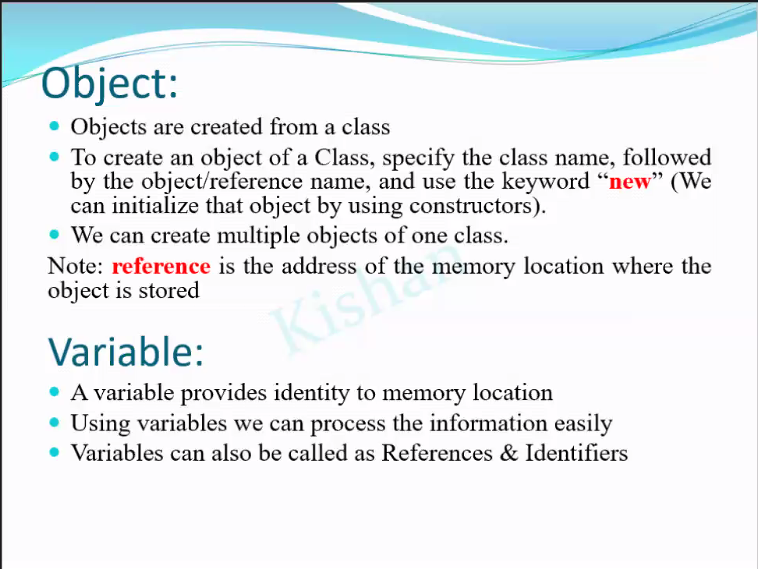

### Naming Conventions of a Java Identifier
1. A java identifier can start with
- A - Z
- a - z
- $ (or) _ (underscore)
2. A java Identifier never start with NUBMER, but we can use any number combination between 0 to 9.
3. We can use only 2 symbols in Identifier names `$ or _ `
4. There should not be any spaces between the Identifier names. 
5. we can use any length as Identifier length
6. as java is case sensitive both int a = 10 and int A = 20; both are different
7. All 50 java language keywords cannot be used as Identifier names
8. `true` `false` and `null` these are `literals` (values) we cannot use them as Identifier names
9. We can use java class names as Identifier names but it is highly `NOT RECOMMENDED`

### Separators
1. ( ) --> we can write method parameters and conditions
2. { } --> they represents a BLOCK of code 
3. [] --> they represents an Array 
4.   ,   --> it is used to separate variables and parameters 
5.   ;   --> it marks the end of a statement 
6.   .   --> it is used to call a method ( it represents belongs to )